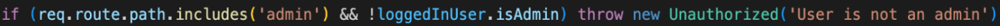

# Wanderlust ReadMe

## Description
For this project, we were put into groups and asked to build our first full-stack project. The app was to be built using MongoDB, Express, Node.js, and React, also known as the MERN stack. 

My group and I decided to build a travel website that we called Wanderlust.

## Deployment Link
http://travel-website.herokuapp.com/

## Timeframe & Working Team
We were presented with the project brief at 14:00 on Wednesday, March 21st, 2023, and had to present the site in the afternoon of Friday, March 31st. We were put into groups of three for this project.

## Technologies Used
* MongoDB
* Mongoose
* Express.js
* JavaScript/JSX
* React
* Node.js
* SASS/CSS
* HTML
* GitHub
* Trello
* QuickDBD
* Excalidraw

## Brief
You must:
* Build a full-stack application by making your own backend and your own front-end
* Use an Express API to serve your data from a Mongo database
* Consume your API with a separate front-end built with React
* Be a complete product which most likely means multiple relationships and CRUD functionality for at least a couple of models
* Implement thoughtful user stories/wireframes that are significant enough to help you know which features are core MVP and which you can cut
* Have a visually impressive design to kick your portfolio up a notch and have something to wow future clients & employers. ALLOW time for this.
* Be deployed online so it's publicly accessible.

Necessary Deliverables:
* A working app hosted on the internet
* A link to your hosted working app in the URL section of your Github repo
* A git repository hosted on Github, with a link to your hosted project, and frequent commits dating back to the very beginning of the project
* A readme.md file with:
    * An embedded screenshot of the app
    * Explanations of the technologies used
    * A couple paragraphs about the general approach you took
    * Installation instructions for any dependencies
    * Link to your user stories/wireframes – sketches of major views / interfaces in your application
    * Link to your pitch deck/presentation – documentation of your wireframes, user stories, and proposed architecture
    * Descriptions of any unsolved problems or major hurdles you had to overcome

## Planning
The first thing we did was create a wireframe using Excalidraw. This helped us to visualise how our site would be structured. See below a screenshot of the wireframe I produced for this app:

The site would open with a home landing page featuring an image in the middle of the top row. A navbar would be located at the top, containing links to login, register, and an "All Destinations" page. Clicking on the login and register links would bring up a modal with a form for users to complete their login or registration.

At the bottom of the landing page, there would be a section called the "USP" (Unique Selling Proposition), consisting of buttons that filtered destinations based on temperature ranges. The coldest destinations would be on the left, while the hottest ones would be on the right. Upon loading the page, the destinations would be sorted into one of the four temperature ranges based on the average daily high temperature of each country in the current month. The selected temperature range would determine the background image displayed to the user. As the user changed the temperature filter, the background image would change accordingly to depict destinations within the selected range and their corresponding weather conditions. For example, if it was July and the user selected the hottest filter, they might see a summer image of Florence instead of a winter image. Similarly, if the user visited the site in December and selected the coldest option, they might see a winter image of London. This feature aimed to inspire users with destination ideas based on their desired temperature preferences. Next to the filter, an Explore button would be available to access the Destination Index page with the selected temperature filter applied.

On the Destination Index page, users would see cards for each destination within the selected temperature range. They would also have the option to apply additional filters as desired. Clicking on a destination card would redirect the user to the respective destination page. Here, users would find comprehensive information and images related to the destination, along with reviews left by other users. The information would include an interactive map of the area and a 7-day forecast, both imported using a third-party API.

Any visitor to the site would be able to browse destinations and read reviews. However, only registered and logged-in users would be able to leave reviews. Once logged in, users could view all the reviews they had left on their profile page, where they would also have the option to delete their reviews.

If a logged-in user had administrative privileges, they would have additional functionality. From their profile page, they could create destinations and view the destinations they owned (either randomly assigned ones from the seed data or ones they had added themselves). Subsequently, we decided to create a separate admin page accessible through the profile page of an admin to support these additional administrative features.

After finalising the UI design, we started considering the structure of the database. Recognising the importance of having substantial data, we used QuickDBD to create a diagram (shown below) to help us visualise and plan the relationships between different data entities.

As we were working in groups of three, we recognised the importance of maintaining good communication and coordination to prevent duplicate work and ensure that all tasks were completed. To facilitate this, we utilised a Trello board, shown below, to track our project progress. Additionally, we conducted daily group stand-up meetings in the mornings to discuss our individual tasks, provide updates, and address any challenges or questions that arose.

Instead of assigning specific tasks to individuals, we adopted a flexible approach where each team member could choose the tasks they felt most comfortable with or were interested in working on. This allowed everyone to contribute according to their strengths and preferences, promoting a sense of ownership and autonomy within the group. By utilising this approach, we aimed to maximise productivity and collaboration among team members.

## Build Process: Back-end
The first task I undertook was to create the schemas. While most of the fields in the destination schema required minimal validation, I implemented additional validation specifically for the highTemps and lowTemps fields. See below:

To ensure that admins creating or editing a destination would provide valid input, I implemented validation that required them to enter 12 integers in order to successfully submit the request.

In order to enable user reviews for destinations, I created a review schema and established an embedded relationship with the destination schema.

To display the average ratings of destinations on the website, I introduced an 'averageRating' field as a virtual field. This virtual field allowed us to calculate and display the average rating without the need to store it as a separate field in the database.

Moving on to the user schema, I included three virtual fields: password confirmation, reviews, and destinations. By creating the reviews and destinations as virtual fields, we were able to display them as fields within user objects without duplicating records.

The password confirmation virtual field was specifically designed for use during the registration process. It ensured that users entered their chosen password correctly by comparing it with the password confirmation field.

I added pre-validation middleware that checked if the password and passwordConfirmation fields matched during user registration. If they did not match, the registration request would be invalidated.

Additionally, I implemented pre-save middleware to encrypt users' passwords using bcrypt before they were stored in the database. This added an extra layer of protection for user credentials.

I also created a custom method called validatePassword, which would be invoked during login attempts. This method compares the password entered by the user with the hashed password stored in the database and returns true or false accordingly, enabling secure user authentication. See below the code relating to the ‘passwordConfirmation’ field and associated middlewares:

With the user model finalised, I proceeded to add the owner fields to the destination and review schemas as reference relationships. This allowed us to associate each destination and review with their respective owner/user.

Next, we collected the data on destinations and prepared the seed file. Considering our site's operation, we wanted to ensure that only admins would be assigned as owners of seeded destinations. To achieve this, I utilised the filter method to create an array of admins from the array of all users. Then, using the Math.random method, I randomly assigned admins as owners to the destinations, ensuring a fair and randomised distribution.

By implementing this approach, we maintained the integrity of ownership and ensured that only admins had control over the seeded destinations.

To enable users to log in and register from any page on the site using a modal, we needed a way for the authentication controller to differentiate between login and registration requests on the backend. Since a registration request would include the passwordConfirmation key in the request body object, I used the following code to access this information. If the passwordConfirmation key existed, the controller would attempt to register the user. Otherwise, it would handle a login attempt.

My next task was to create the update destination controller. This presented challenges due to the diverse range of data types being received by the backend. Consequently, I had to implement additional measures to ensure that the incoming data met the requirements outlined in the destination schema. Given that admins would be responsible for inputting the data, I incorporated code (lines 48-51) to properly reformat the data, ensuring its compatibility with the database.

As the destination ID would be included in the request body, and I didn't want to add it as a field in the destination object within our database, I utilised the `Object.assign` method. This allowed me to explicitly specify the fields from the request body that I wanted to store, while excluding the destination ID. By using `Object.assign`, I could selectively assign the desired fields to the destination object without modifying its existing structure or introducing additional properties.

I was also responsible for creating the add and delete destination controllers, which would be accessible from the admin page, as well as the delete review controller, accessible via the profile page.

## Build Process: Front-end (React.js)
In the React component, my initial task involved creating arrays of destinations for each temperature range when the user visits the homepage. I accomplished this using the filter method below:

Next, my task involved enabling the user to cycle through the images of destinations within each temperature range. One of my teammates discovered a useful slideshow component online, simplifying the implementation process. My focus was on dynamically changing the background images in the slideshow based on the user's selections.

To achieve this, I assigned values to buttons and updated the `slideXDestination` states whenever a button was pressed. These updated states were then passed into template literals, which populated the background image URLs. This allowed for the dynamic rendering of the appropriate destination images within the slideshow component. See below:

On the destination index page, I took charge of the creation and application of the filters. This was something I had done before and so was a relatively straightforward task.
On the destinationSingle pages, we worked as a team to import data from the open-meteo API which we would use to display weather forecast data.
I also implemented logic, similar to that used in the aforementioned slide show, to enable the users to cycle through images of the destination on the destinationSingle page.
Another thing we did as a team on this page was the iconification. We were planning to display a lot of information on this page so we thought it was important to break this information up using icons to keep the user engaged. We used Font Awesome icons to do this and were very happy with the outcomes, see below:

I wrote most of the JSX code behind the admin and profile pages. On the profile page we wanted to display the reviews owned by the user. This meant finding a way to access the review information on the user object which was somewhat buried by multiple layers of objects and arrays, as shown below:

Accessing this data was an enjoyable challenge for me and I was happy to achieve this on my own with the below code:

On the admin page, we wanted to display destinations owned by admins. This task was not as challenging as accessing and displaying the review data on the profile page. However, implementing the edit and add functionality introduced additional challenges.

Since admins would be able to update destinations from an "/admin" endpoint without any direct reference to the destination itself, I had to find a way to communicate the destination ID to the backend without using the "useParams" hook. To achieve this, I assigned the destination ID as a value to the "edit" button when the page loads. See below:

This would allow me to set the "editID" state as the destination ID, which can be used later to include it in the PUT request body. 

Regarding the UI for editing and adding destinations, I implemented forms and displayed them using modals. Below is an example of the edit modal:

I linked the modal fields to keys in the edit and add form states. During this process, I conducted research on front-end validation to ensure that users input the high and low temperature data in the correct format. I added the "pattern" parameter to the input field, which required the admin to enter 12 integers, positive or negative, for the data to pass through this initial validation step:

## Build Process: Front-end (Styling)
With regards to the CSS and SASS, we tackled most of this as a team, adding bits and pieces as we went.

## Challenges
A challenge I encountered early on was related to our decision to enable users to log in and register from any page on the site using a modal. In previous projects, I had only allowed users to make these requests through specific login and register endpoints, making it clear from the endpoint itself what type of request it was.

Allowing users to make these requests from any endpoint posed the challenge of differentiating between the two requests in the backend auth controller. To address this, I devised a solution by recognising that a registration request would include the "passwordConfirmation" key in the request body. In the code snippet below, I accessed the object keys and, if the "passwordConfirmation" key existed, the controller would attempt to register the user; otherwise, it would handle a login attempt.

I encountered another problem related to distinguishing between admins and standard users on our site, which I was pleased to solve. Since I hadn't dealt with multiple account types in my previous work, I had to conduct some research to figure out how to access the required fields. Here's a code snippet showing my code:

As mentioned in the build process, accessing and displaying the user's review data on the profile page posed a challenge. However, I was pleased to overcome it by utilising a sequence of array methods, as shown in the code snippet below:

## Wins
Overall, I am delighted with the aesthetics of the site and the effective collaboration within our team.

One significant achievement, for which I took the lead, was the logic that allowed users to cycle through an array of images on the landing page. Although the logic itself (shown below) was relatively straightforward, I had limited experience with React before this project. Therefore, I was extremely pleased to discover a solution that utilised a separate state for each temperature range, see below:

Achieving this on the landing page added significant value to the site. The landing page is often the first impression users have of the site, and it plays a crucial role in catching their attention and inspiring their travels. By providing an engaging and visually appealing experience, we were able to create a captivating first impression and enhance the overall user experience.

## Key Takeaways
This was my biggest project to date, so naturally, I learned a lot from it.

I gained proficiency in effectively and efficiently managing tasks as part of a team using Trello. Additionally, I recognised the importance of communication during larger group projects.

Another valuable lesson I learned was the significance of planning. It can be challenging to make changes to code that has already been developed, especially when it comes to CSS. Proper planning helps avoid such difficulties.

As this was my first full-stack project, I acquired knowledge about the interaction between the front-end and back-end. A key takeaway was understanding how to communicate user data input from the UI to the database.

Finally, I dedicated a substantial amount of time to coding in React JSX during this project. This allowed me to gain a comprehensive understanding of React, specifically in working with states, passing states between components, and handling forms in React.

Overall, this project has been an invaluable learning experience, significantly enhancing my skills and knowledge in web development.

## Bugs
Fortunately, we only encountered minor bugs which relate to mobile responsive breakpoints. These emerged when we added new features towards the end of the development process.

## Future Improvements
This project was marked by the relentless passage of time, making it our greatest adversary. From the project's outset, we had a well-defined vision for the site, but we were well aware that it would demand a considerable amount of hard work. Despite our dedicated efforts, which often extended into intense days and late nights, we ultimately fell short of completing everything as originally planned.
Some of the things I would like to add in future are:
* Destination names and links on the landing page background
* Additional validation when adding
* Better animations between images when cycling through on the landing page and destinationSingle page
* Stars to select the rating given on a view instead of the slider on the destinationSingle page
* Welcome messages on log in and more messages informing the user why actions, such as posting a review, didn’t work
* Edit reviews functionality from profile page
* Reviews link to destinations on profile page
* User logged in on registration
* More styling on the user and admin pages
* More mobile responsiveness
* More data
